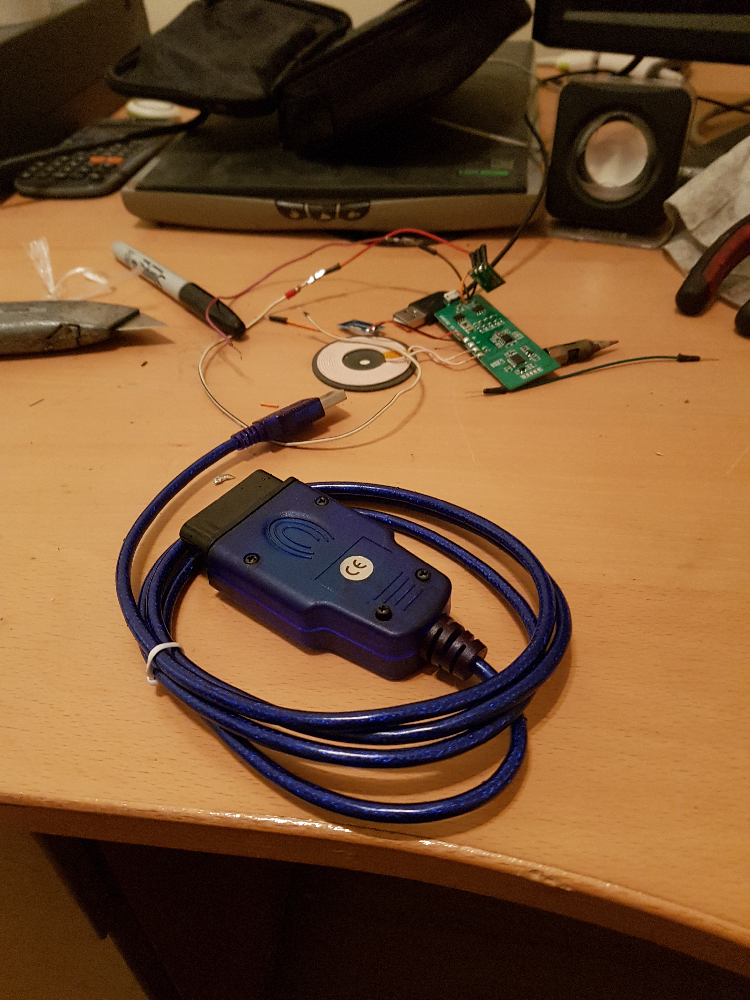
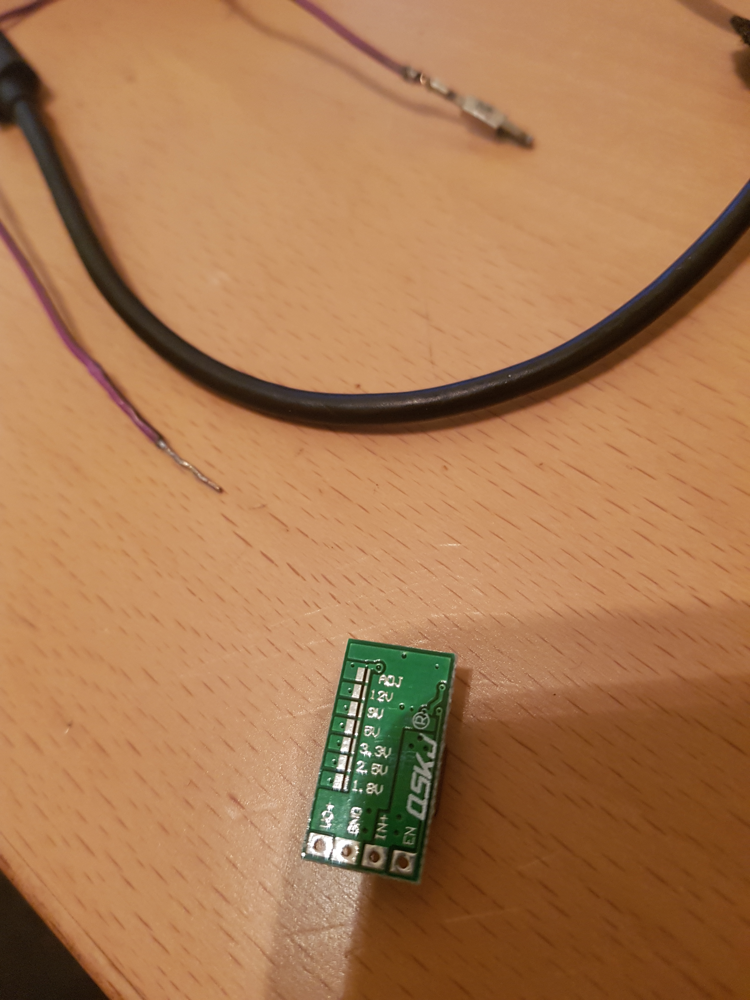
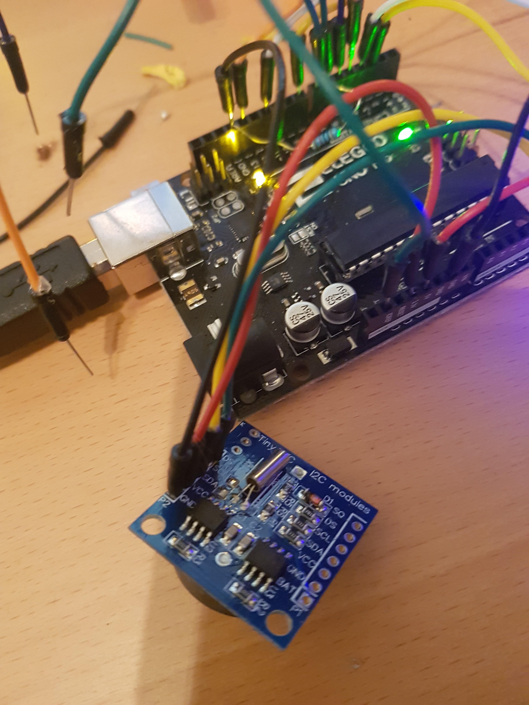
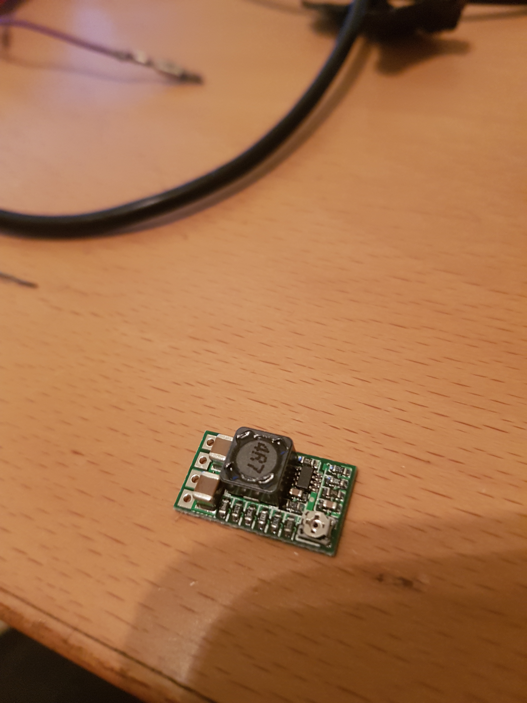

## Welcome to FISCuntrol ##

**FISCuntrol** is an custom FIS display for Volkswagens.  By combining an FT232RL KKL cable, an Ardinuo Uno and an RTC (the **DS1307**), the stock cluster can be used to display information.  Just like VCDS, FISCuntrol uses the KWP1281 protocol and is able to login to specific modules within the car and retrieve useful measuring blocks.

Sticking with the OEM look, the module is designed to be incorporated into the original cluster and stalk for ease of use.  Therefore, the keys for interaction are:

- Reset
- Up
- Down

### Features:  ###
- Personalised welcome message 
- RPM
- Load
- MAF Reading
- N75 Duty
- Boot
- Lambda
- *Any measuring blocks as per VCDS* 

### Future Features: ###

- Fault Code retrieval
- User defined variables
- Boot logo

### Contribute: ###
Currently, the source code is being revised by Adam Forbes.  Comments and suggestions are more than welcome.  In fact, they would be appreciated.  I have built this for me, but I'd to hear what you would like to see in it.

If you'd like to buy me a beer or donate to the cause, my PayPal is:

**[adamforbes@hotmail.com](adamforbes@hotmail.com)** **[facebook.com/adamforbes92](facebook.com/adamforbes92)**

### What is supported? ###
- Custom greeting (Good morning, good afternoon, good evening)
- Special dates (Birthday, Christmas, New Year)
- KWP1281 protocol
- Measuring block reading
- Disable with three medium presses on Reset key on the stalk
- Rotate to the next block (up)
- Rotate to the previous block (down)

### Defined Groups: ###
``int engineGroups[NENGINEGROUPS] = {2, 3, 31, 32, 115};``
``int dashboardGroups[NDASHBOARDGROUPS] = { 2 };``

As seen above, the two defined groups are for the Engine (ECU) and the Cluster (dashboard).  In the future, these will likely expand to become the other available modules:
 
``#define ADR_Engine 0x01 // Engine``

``#define ADR_Gears  0x02 // Auto Trans``

``#define ADR_ABS_Brakes 0x03``

``#define ADR_Airbag 0x15``

``#define ADR_Dashboard 0x17 // Instruments``

``#define ADR_Immobilizer 0x25``

``#define ADR_Central_locking 0x35``

``#define ADR_Navigation 0x37``

### Build Your Own: ###

Everyone loves a bit of DIY, so build your own.  You'll need:

- OEM/Original FIS Cluster
- Arduino Uno/Nano
- DS1307 RTC (Real Time Clock)
- FT232RL KKL cable
- 5v Buck Converter
- Breadboard wires

.

.

.

.

.

The Buck Converter is a 5v, 3A version.  That will power the Ardinuo, the RTC and the KKL cable.

### Prepare the KKL Cable ###

The hack designed by Andrew consists of taking advantage of the LM comparator that incorporates the cable OBD to use it with the Arduino through SofwareSerial.

.

- Cut the trace of the  FTDI chip that goes to TX and solder the new TX line for the Arduino.
- Solder the RX cable to Arduino.
- Solder the 5v from the buck converter to the "To Arduino" wire.  The FTDI chip requires this 5v.

The result is this:

.

## Connections between Arduino and the Peripherals:

The Ardinuo will be powered from the 5v Buck Converter:

.

.

.

The cluster pins must be connected to the Ardinuo pins:

- Clock:  Pin 30 on Cluster harness -> Pin 4 on Arduino
- Data:   Pin 31 on Cluster harness -> Pin 5 on Arduino
- Enable: Pin 32 on Cluster harness -> Pin 6 on Arduino

Note:
- The radio coding must be +16
- Doing this will lose the functionality of displaying the radio information in the cluster
- If the FIS was not OEM, the wiring will not exist and new pins will have to be added into the harness

### Pin Outs ###

Now connect the Ardinuo to the following pins:
`` RX -> 2``

`` TX -> 3``

`` Stalk Push Up -> 4``

`` Stalk Push Down -> 5``

`` Stalk Push Reset -> 6``

`` Switched Ignition (through a 10k resistor) -> 7;``

`` FIS Clock -> 13``

`` FIS Data -> 11``

`` FIS Enable -> 8``

### Acknowledgements & Contact: ###

This project would not have been possible without the help of:

* Samuel Ibanez - [https://github.com/ibanezgomez/fisblocks](https://github.com/ibanezgomez/fisblocks)
* Alexander - [http://grauonline.de/wordpress/?p=74](http://grauonline.de/wordpress/?p=74)
* Tomáš Kováčik - [http://kovo-blog.blogspot.com.es/2013/11/audi-fis-3-line-protocol.html](http://kovo-blog.blogspot.com.es/2013/11/audi-fis-3-line-protocol.html)
* Nefmoto comunity & the awesome ME7Logger - [http://www.nefmoto.com](http://www.nefmoto.com)

You can get in touch for any queries through the Issue List or send me an email to [adamforbes@hotmail.com](adamforbes@hotmail.com).
